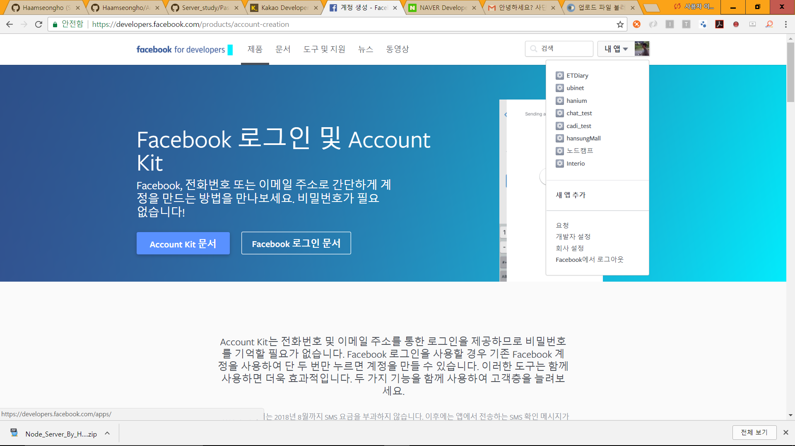

# Passport

- SNS 연동 로그인을 진행할 때 사용하는 것으로 서버 측에서 
세션을 관리할 때 사용한다.
- 여기서는 Kakao , Facebook , Naver passports를 다룬다.


---
## 1. 사용법

> npm install passport-kakao --save

> npm install passport-facebook --save

> npm install passsport-naver --save 


---


<a href="https://developers.facebook.com/"> 페이스북 개발자 페이지</a>

<a href="https://developers.kakao.com/"> 카카오 개발자 페이지 </a>

<a href="https://developers.naver.com/main/"> 네이버 개발자 페이지 </a>

해당 사이트로 들어가서 각 아이디로 로그인하기 과정을 진행한다.

## 2. 예시 
---

### [페이스북 예시]




<br />
<hr />

## 3. 코드 설명

```

 		<p>로그인 페이지</p>
			<form action="/auth/facebook" method="get">
   			 <input type="submit" value="페이스북 로그인 하러가기" name="fb_login">
			</form>
			<form action="/auth/kakao" method="get">
   			 <input type="submit" value="카카오톡 로그인 하러가기" name="kk_login">
			</form>
			<form action="/auth/naver" method="get">
   			 <input type="submit" value="네이버 로그인 하러가기" name="nv_login">
			</form>


```

View 에서는 위와 같이 정해주는데 url 넘기는 부분에서는 
/auth/~~/ 로 정의해준다.

- 해당 라우터에서 passport가지고 인증과정을 거칠 것이기 때문
- 인증을 거친 뒤엔 callback으로 라우팅하고 성공시 , 실패시 
redirection 할 것.
- 콜백 URL은 각 개발자 페이지에 정의해줘야 한다.


``` 

	var express = require("express");
	var router = express.Router();
	var passport = require("passport");
	var fb_login = require("../passports/facebook");
	var kk_login = require("../passports/kakao");
	var nv_login = require("../passports/naver");
		router.get("/login",function (req,res,next) {
  		  res.render("login.ejs");
		});

		router.get("/logout",function (req,res,next) {
   		 req.logout();
   		 res.redirect("/");
		});

	fb_login(router,passport);   // 페이스북 로그인
	kk_login(router,passport);   // 카카오톡 로그인
	nv_login(router,passport);   // 네이버 로그인

	module.exports = router;

```

위 라우터에서는 로그인 요청 url이 들어올 경우 로그인 페이지로,
 
로그아웃 요청 url이 들어올 경우 로그아웃 시키는 부분입니다.


나머지 sns로그인 구현 부분은 passports 폴더 내의 정의된 파일을 참조하시면 됩니다.

개념 설명을 이어 하자면

```

     passport.use(new FacebookStrategy({
            clientID: "177565472782815",
            clientSecret: "1e62b82a2c98c2e10065bda05b519215",
            callbackURL: "/auth/facebook/callback"
        }, function (accessToken, refreshToken, profile, done) {
            console.log("facebook" + profile);
            done(null, profile);
        }
    ));


```

위와 같이 개발자 페이지에서 받은 ClientID와 Secret키 그리고 
인증 이후에 callback을 받을 URL을 정의해 줍니다.

이렇게 할 경우 결과로 얻는 콜백 함수 인자에는 토큰값과 
프로필 (해당 sns에 관련된 프로필내용)을 받아볼 수 있습니다.


```


    passport.serializeUser(function (user, done) {
        console.log("serializeUser() 호출");
        done(null, user);
    });
    passport.deserializeUser(function (user, done) {
        console.log("deserializeUser() 호출");
        done(null, user);
    });


```

passport는 serializeUser와 deserializeUser 함수가 있는데 ,
 
serializeUser메소드는 인증 과정을 거친 이 후 한 번 호출되는 메소드로 인증이 잘 되었음을 알려주는 메소드입니다.

deserializeUser메소드는 serializeUser메소드 호출 이 후에 진행되는 부분으로 페이지가 이동함에 따라 사용자 세션이 지속적으로 유지 되어 호출됨을 보여줍니다.


``` 

       router.use(expressSession({
           secret: "asdfqw12aa",
           resave: true,
           saveUninitialized: true
      }));
      router.use(passport.initialize());
      router.use(passport.session());


```

그 다음 해야할 작업이 세션 관리하는 것입니다. 
우선 expressSession호출을 통하여 위와 같이 정의해 줍니다.
(secret은 아무거나 하셔도 무관합니다.)

세션을 먼저 등록한 뒤 라우터에서 passport를 초기화 하고 passport의 세션을 사용하겠다고 선언해야 합니다.

★ 순서가 중요합니다. 위와 같이 진행해주셔야 합니다.


```

    router.get("/auth/facebook", passport.authenticate('facebook'));
    router.get("/auth/facebook/callback", passport.authenticate('facebook',
        {
            successRedirect: "/login_success",
            failureRedirect: "/login_fail"
        }));

    router.get("/login_success", ensureAuthenticated, function (req, res) {
        console.log("login_success 호출");
        res.redirect("/profile");
    });
    router.get("/login_fail", function (req, res) {
        console.log("로그인 실패");
        res.redirect("/"); // 로그인실패 --> 메인 페이지 이동
    });
    router.get("/profile", function (req, res) {
        console.log("프로필 호출");
        console.log(req.user);
        if (Array.isArray(req.user)) {
            res.render("profile.ejs", {user: req.user[0]._doc});
        } else {
            res.render("profile.ejs", {user: req.user});
        }
    });

```

- /auth/facebook URL로 보낼 경우 facebook Strategy를 이용하여 passport가 인증 과정을 거칩니다.
- 인증이 완료된 경우 /auth/facebook/callback URL로 넘어갑니다. 
- 인증이 올바르게 될 경우 successRedirect , 실패할 경우 failureRedirect 로 넘어갑니다.
- /profile URL로 보내질 경우 해당 유저의 세션을 확인하는 것이 
req.user이기 때문에 해당 세션이 존재할 경우 유저 세션 정보 배열에서 처음 내용을 뷰 단으로 같이 보냅니다.
만일 없을 경우 해당 유저를 세션으로 정의하여 보내게 됩니다. 

~~~

     function ensureAuthenticated(req, res, next) {
         if (req.isAuthenticated()) {
             console.log("인증 완료");
             next();
         } else {
             res.redirect("/login");
         }
     }

~~~

요청에 대한 인증 확인 함수입니다. 

